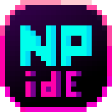

<div align="center">
  <br>
  
  <h1>🍇 NPidE 🍇</h1>
  <strong>A highly configurable minimalistic IDE for language developers</strong>
</div>
<br>
<p align="center">
    <a href="https://github.com/JetBrains/kotlin">
      
    </a>
    <a href="https://github.com/gradle/gradle">
      
    </a>
    <a href="https://github.com/JetBrains/compose-jb">
      
    </a>
    <a href="https://github.com/antlr/antlr4">
      
    </a>
</p>
<p align="center">
  <a href="#-why-npide">Why NPidE?</a> •
  <a href="#-supported-languages">Supported languages</a> •
  <a href="#%EF%B8%8F-installation">Installation</a> •
  <a href="#-how-to-create-project-and-buildrundebug-it">How to create project and build/run/debug it</a> •
  <a href="#-functionality">Functionality</a> •
  <a href="#-how-to-add-new-language">How to add new language?</a> •
  <a href="#-architecture">Architecture</a> •
  <a href="#%EF%B8%8F-license">License</a> •
  <a href="#-authors">Authors</a> •
  <a href="#-support">Support</a> •
  <a href="#-plans">Plans</a>

</p>

# ❔ Why NPidE?
The main feature of this IDE is its customizability. You can add supported languages, project types and so on in a declarative style using config files

# 📙 Supported languages


You can look at the languages in [this repo](https://github.com/nsu-null/npide-langs)

# ⚙️ Installation

1. Clone repository OR you can just download NPidE from [release page](https://github.com/nsu-null/NPidE/releases)
    ```console
    git clone https://github.com/nsu-null/NPidE
    ```
2. Create JAR
   ```console
   gradle jar   # or ./gradlew jar 
   ```
3. Execute JAR
   ```console
   java -jar path/to/NPidE-<version>.jar
   ```
   
# 🏭 How to create project and build/run/debug it

1. Open NPidE then click the button "Add new project" and choose project directory
2. Download language package from [repo](https://github.com/nsu-null/npide-langs) and locate it(recommend to place it in the root of the project)
3. Click the buttons "Menu" -> "Config" and write project name, choose configuration file of language - LanguageDistributionInfo.yaml and choose grammar and syntax highlighting files
4. Write your code in our IDE(you can create/remove/rename/.. directories, files)
5. Again click the buttons "Menu" -> "Config" and write entry point/main class and add all the project files
6. Now you can close it and click the buttons "Build"/"Run"/"Debug" create breakpoints ans so on

# 🔢 Functionality
* Create/remove projects
* Configurate compilation/execution/debug for languages
* Configurate grammar and highlight syntax for languages
* Open/edit/close/create/delete/save/rename/.. files
* Build/Run/Debug project with supported languages
* Add/remove breakpoints for debugging
* Watch system variables in debug mode
* Step system in debug mode
* Terminal window in NPidE

# ➕ How to add new language?
To fully implement the language, you need:
- everything that is for a specific language (debugger, compiler ..)
- the principal way to let the IDE know about the compiler/debugger/.. is to inherit from the interface and specify it in the language config. But there is also an existing implementation that delegates to another program (for example, a Python script or any other language), passing all information about the project to it.
- language grammar file (g4)
- language syntax highlighting file (json)
- configuration file - LanguageDistributionInfo.yaml (you can find example of config file [here](https://github.com/nsu-null/npide-langs/blob/main/clojure/LanguageDistributionInfo.yaml))

And then you can create PR to this [repo](https://github.com/nsu-null/npide-langs) :)

# 🔧 Architecture

## Modules

### <a href="https://github.com/nsu-null/NPidE/tree/main/src/main/kotlin/ru/nsu_null/npide/parser">🔖 Parser</a> 
  This module is responsible for analyzing the files being edited and create internal structure for describing this ones
  - translation - creates symbol tables and so on
  - generator - generates parser and lexer files based on provided grammar
  - compose_support - allows to connect highlighting to our editing text area
### <a href="https://github.com/nsu-null/NPidE/tree/main/src/main/kotlin/ru/nsu_null/npide/ide/editor">✍ Editor</a> 
  - Editor - represents a state of a file editor
  - Editors - controls currently open Editors
### <a href="https://github.com/nsu-null/NPidE/tree/main/src/main/kotlin/ru/nsu_null/npide/ide/console">💻 Console</a>
  - Console - responsible for getting output from build/run/debug
  - ConsoleView - responsible for drawing the aforementioned output
### <a href="https://github.com/nsu-null/NPidE/tree/main/src/main/kotlin/ru/nsu_null/npide/ide/buttonsbar">🖱 ButtonsBar</a>
  - ButtonsBar - responsible for drawing bar for buttons 
  - ButtonActions - responsible for handling button clicks
  - Calls NPidE's methodsto attach strategies (build/run/debug) to console
### <a href="https://github.com/nsu-null/NPidE/tree/main/src/main/kotlin/ru/nsu_null/npide/ide/menubar">🎛 MenuBar</a>
  - MenuBar - responsible for drawing bar for menu buttons(top panel) 
  - ConfigDialog - responsible for handling menu button clicks and open dialog for project configuration
### <a href="https://github.com/nsu-null/NPidE/tree/main/src/main/kotlin/ru/nsu_null/npide/ide/config">🔗 Config</a>
  responsible for storing and reading configuration from YAML-file
  - Config Manager -  manage project configuration file 
  - LanguageProviders
### <a href="https://github.com/nsu-null/NPidE/tree/main/src/main/kotlin/ru/nsu_null/npide/ide/filetree">📁 FileTree</a>
  - FileDialog
  - FileTree 
  - FileTreeView
  - ExpandableFile
### <a href="https://github.com/nsu-null/NPidE/tree/main/src/main/kotlin/ru/nsu_null/npide/ide/projectchooser">🏗 ProjectChooser</a>
  - ProjectChooser - responsible for handling choosing projects
  - ProjectChooserView - responsible for drawing project lists 
  - DiskHomeDirectoryRepositoryManager - manage project files on disk
### <a href="https://github.com/nsu-null/NPidE/tree/main/src/main/kotlin/ru/nsu_null/npide/ide/breakpoints">🔴 Breakpoints</a>
  - BreakpointStorage - responsible for adding/removing breakpoints


## Patterns
- Singleton
- Proxy
- Observer
- Delegation
- Object pool
- Factory
- Strategy

# ⚖️ License
[](https://tldrlegal.com/license/mit-license)

# 📕 Authors
| |   |   |   |
| ---------------------------------------------------------------------------- | ------------------------------------------------------------------------------ | ------------------------------------------------------------------------- | ------------------------------------------------------------------------------ |
|                                   **Brek Roman**                            |                                      **Vasilev Pavel**                         |                              **Patrushev Borya**                        |                                 **Tarasov Artёm**                              |

# 🏥 Support

# 📆 Plans
* Pair programming
